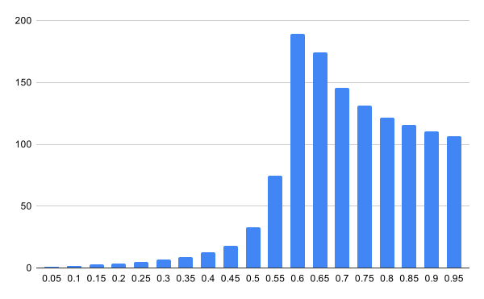
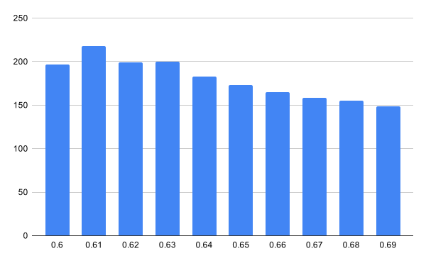

# Results for the Tree Burning Simulation 

## Table 1
`Size` | `Density` | `Ticks (Average)`
---: | ---: | :---: 
100 | 0.05 | 1.2 
100 | 0.10 | 1.9 
100 | 0.15 | 2.8 
100 | 0.20 | 3.6 
100 | 0.25 | 4.7 
100 | 0.30 | 7.0 
100 | 0.35 | 8.8 
100 | 0.40 | 12.6 
100 | 0.45 | 18.2 
100 | 0.50 | 32.9 
100 | 0.55 | 74.5 
100 | 0.60 | 189.6 
100 | 0.65 | 174.4 
100 | 0.70 | 145.4 
100 | 0.75 | 131.3 
100 | 0.80 | 121.8 
100 | 0.85 | 115.8 
100 | 0.90 | 110.5 
100 | 0.95 | 106.2 

### Chart Version 

## Table 2 

`Size` | `Density` | `Ticks (Average)`
---: | ---: | :---:
100 | 0.60 | 196.6 
100 | 0.61 | 218.0 
100 | 0.62 | 199.4 
100 | 0.63 | 200.3 
100 | 0.64 | 182.6 
100 | 0.65 | 173.3 
100 | 0.66 | 165.0 
100 | 0.67 | 158.8 
100 | 0.68 | 154.9 
100 | 0.69 | 148.9 

### Chart Version 

